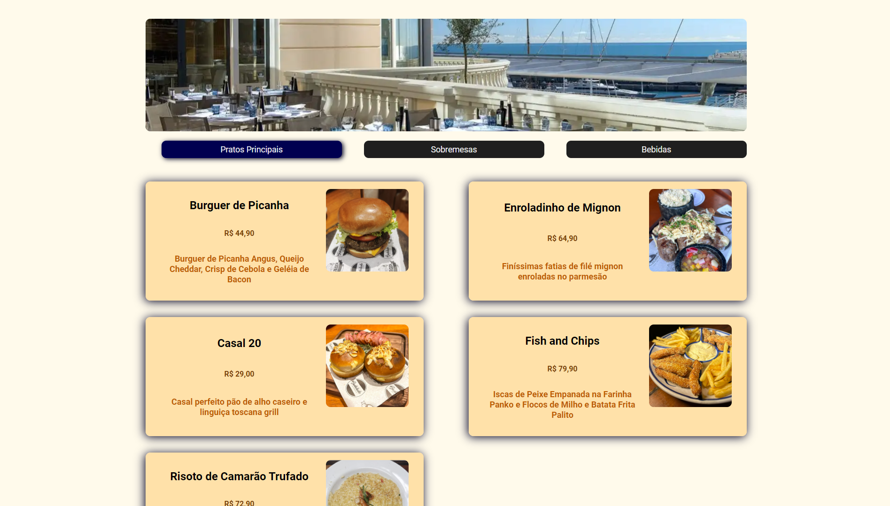

<h1 align="center"> Cardapio web </h1>

Project developed during the Hashtag Programação event.

  <a href="#-Technologies">Technologies</a>&nbsp;&nbsp;&nbsp;|&nbsp;&nbsp;&nbsp;
  <a href="#-Project">Project</a>&nbsp;&nbsp;&nbsp;|&nbsp;&nbsp;&nbsp;
  <a href="#memo-License">License</a>&nbsp;&nbsp;&nbsp;|&nbsp;&nbsp;&nbsp;

  

 

  

## 🚀 Technologies

This project was developed using the following technologies:

- React js
- Vite
- JavaScript
- HTML5
- CSS3

## 💻 Project

Web menu project developed with React.js, leveraging useState to enhance the user navigation experience across different menu pages. This implementation aims to provide a smoother and more intuitive interaction, ensuring that users can easily explore the available menu options with simplified and responsive navigation.

## :memo: License

This project is under the MIT license.

---

